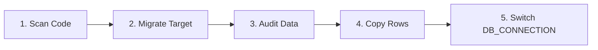

# Switching Databases: Scan, Audit & Copy

Switching a production Laravel application from one database engine to another (for example, migrating from CockroachDB to MatrixOne or MySQL to PostgreSQL) involves three major challenges:
1. **Finding incompatible SQL**: Raw SQL queries hidden inside string literals.
2. **Schema and type mismatches**: Columns that are narrower on the target (e.g. 64-bit integer on source fitting into a 32-bit integer column on target, or strings exceeding `varchar(n)`).
3. **Data migration safety**: Preserving foreign key order, handling time zone offsets, resetting auto-increment sequences, and resuming interrupted transfers.

**Laravel DB Portable** provides three Artisan commands designed to execute this workflow with confidence.

---

## 5-Step Migration Workflow



---

## Step 1: Scan for Incompatible SQL (`db-portable:scan`)

The scanner tokenizes PHP code and inspects string literals. It ignores code comments and non-SQL strings, flagging syntax specific to a database family:

```bash
# Scan default paths (app/, database/, routes/) targeting MatrixOne
php artisan db-portable:scan --target=matrixone

# Scan specific directories targeting MySQL and SQLite
php artisan db-portable:scan app/Filament --target=mysql --target=sqlite

# Output JSON and fail CI on findings
php artisan db-portable:scan --json --fail
```

### Detected Constructs

| Rule | Detected Syntax | Suggested Replacement |
|---|---|---|
| `pg-json-operator` | `col->>'key'` | `where('col->key', ...)`, `whereJsonNumber()` |
| `pg-cast` | `::bigint`, `::text`, `::jsonb` | Eloquent casts, `Portable::castText()` |
| `nulls-first-last` | `NULLS LAST`, `NULLS FIRST` | `orderByNullsLast()` |
| `pg-jsonb-function` | `jsonb_set`, `jsonb_array_length` | `incrementJson()`, `whereJsonLength()` |
| `mysql-backtick` | `\`id\`` in raw SQL | `wrap()` or standard Eloquent |
| `ifnull` | `IFNULL(a, b)` | `COALESCE(a, b)` |
| `mysql-if` | `IF(expr, a, b)` | `CASE WHEN ... THEN ... ELSE ... END` |
| `mysql-limit-offset`| `LIMIT 10, 20` | `LIMIT 20 OFFSET 10` |
| `on-duplicate-key` | `ON DUPLICATE KEY UPDATE` | `upsert()` or `updateOrInsert()` |
| `group-concat` | `GROUP_CONCAT(...)` | `Portable` expression or application logic |

---

## Step 2: Migrate Target Database

Run migrations against the target connection:

```bash
php artisan migrate --database=matrixone
```

---

## Step 3: Audit Data Compatibility (`db-portable:audit`)

The audit command queries min/max values and string lengths on the source database and verifies that all existing data will fit within the target schema:

```bash
# Audit entire schema
php artisan db-portable:audit --from=crdb --to=matrixone

# Audit specific tables
php artisan db-portable:audit --from=crdb --to=matrixone --table=videos --table=orders
```

### Sample Audit Output

```text
+----------------------+------------+----------------------+---------------------------------------------------+
| Table                | Column     | Problem              | Details                                           |
+----------------------+------------+----------------------+---------------------------------------------------+
| videos               | view_count | integer out of range | int (max 2147483647) but the source has 15950438052|
| toeic_exam_user_logs | exam_score | integer out of range | tinyint unsigned (max 255) but source has 500     |
| videos               | title      | string too long      | varchar(20) but source string is 38 characters    |
| tool_only_source     | *          | missing in target    | Table does not exist in target database           |
+----------------------+------------+----------------------+---------------------------------------------------+
```

If any columns are reported as out-of-range, widen the column in your target migrations before copying.

---

## Step 4: Copy Data (`db-portable:copy`)

Copies data from the source database to the target database:

```bash
# Dry run to preview row counts
php artisan db-portable:copy --from=crdb --to=matrixone --dry-run

# Copy all tables
php artisan db-portable:copy --from=crdb --to=matrixone

# Copy specific tables
php artisan db-portable:copy --from=crdb --to=matrixone --table=users --table=videos

# Sample latest 500 rows per table
php artisan db-portable:copy --from=crdb --to=matrixone --sample=500

# Resume after an interruption
php artisan db-portable:copy --from=crdb --to=matrixone --resume
```

### Key Copy Features

1. **Foreign Key Ordering**: Automatically inspects foreign key constraints and copies parent tables before referenced child tables.
2. **Value Conversion via `ValueMapper`**:
   - Timestamps with timezone offsets are converted to UTC for MySQL datetime columns.
   - Booleans convert to `true`/`false` for PostgreSQL and `1`/`0` for MySQL/SQLite.
   - PHP Arrays, Objects, and Collections are serialized as JSON.
   - PHP Enums (UnitEnum and BackedEnum) are mapped to scalar values.
3. **Sequence & Identity Reset**: After copying into PostgreSQL or CockroachDB, sequence counters (`GENERATED BY DEFAULT AS IDENTITY` or `SERIAL`) are updated to exceed the highest copied primary key, preventing duplicate key collisions on subsequent inserts.
4. **Idempotence & Keyset Pagination**:
   - Uses `insertOrIgnore()` so interrupted runs can be restarted safely without creating duplicate rows.
   - Paginates using keyset ordering (`--chunk=500`), avoiding heavy `OFFSET` queries.
   - Detects rows ignored by the target and flags tables as `incomplete` if rows were skipped.
